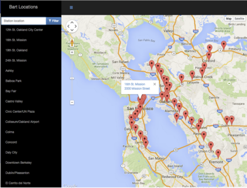
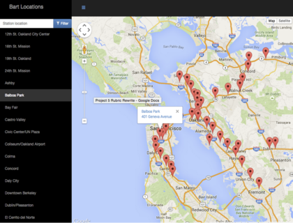
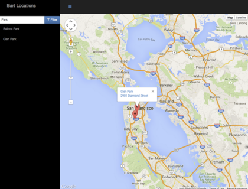
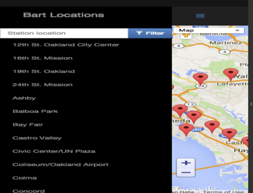

## Project Overview
A single page application featuring a map of a neighborhood that user like to visit. The map including highlighted locations, third-party data about those locations and various ways to browse the content.
## Why this Project?
The neighborhood map application is complex enough and incorporates a variety of data points that it can easily become unwieldy to manage. There are a number of frameworks, libraries and APIs available to make this process more manageable and increases skills in using these packages. 
## What did I Learn?
How design patterns and UI libraries like React assist in developing a manageable codebase. Explored how frameworks can decrease the time required developing an application and provide a number of utilities to use. Finally, implemented third-party APIs that provide valuable data sets that can improve the quality of the application.
## How does this help my Career?
- React is an in-demand technology for Front-End Web Developers
- Interacting with API servers is the primary function of Front-End Web Developers
- Use of third-party libraries and APIs is a standard and acceptable practice that is encouraged
- Asynchronous programming is important to understand in today's market
## Project Requirements
1. Neighborhood Map (React) project showing [BART] locations in the [San Francisco Bay Area]. Clicking a marker on the map should open more information about that location.
 * 
2. Clicking a name in the list view should display the information for the associated marker.
 * 
3. The list of locations should be filterable with a text input or dropdown menu. Filtering the list also filters the markers on the map.
 * 
4. The web app should be responsive (i.e., to mobile devices). Note that a hamburger menu icon used to hide the list on small screens (this is just one possible mobile implementation).
 * 
### Completion Checklist
- [x] Responsiveness
- [x] Usability
- [x] Location Filter
- [x] List View    
- [x] Map and Markers
- [x] Asynchronous API Requests
- [x] Error Handling
- [x] Additional Location Data
- [x] Error Free
- [x] Application Architecture - Proper Use of React
- [x] Offline Use - Service Worker
- [x] Accessibility
- [x] Comments
- [x] README
### How to run this project locally
In the project directory, you can run: 
- `Npm install`  
- `Npm install react-route-dom` 
- `Npm install --save react-google-maps`  
- `npm start`
Runs the app in the development mode. 
Open [http://localhost:3000](http://localhost:3000) to view it in the browser.
The page will reload if you make edits. 
You will also see any lint errors in the console.
### Learn More
- You can learn more in the [Create React App documentation](https://facebook.github.io/create-react-app/docs/getting-started).
- To learn React, check out the [React documentation](https://reactjs.org/).
### Resources
- This project was bootstrapped with [Create React App](https://github.com/facebook/create-react-app).
- [React Google Map](https://tomchentw.github.io/react-google-maps/)
- [Google Maps APIs](https://developers.google.com/maps/documentation/javascript/tutorial)
- [Foursquare Developers Map APIs](https://developer.foursquare.com/docs/api/venues/details)
